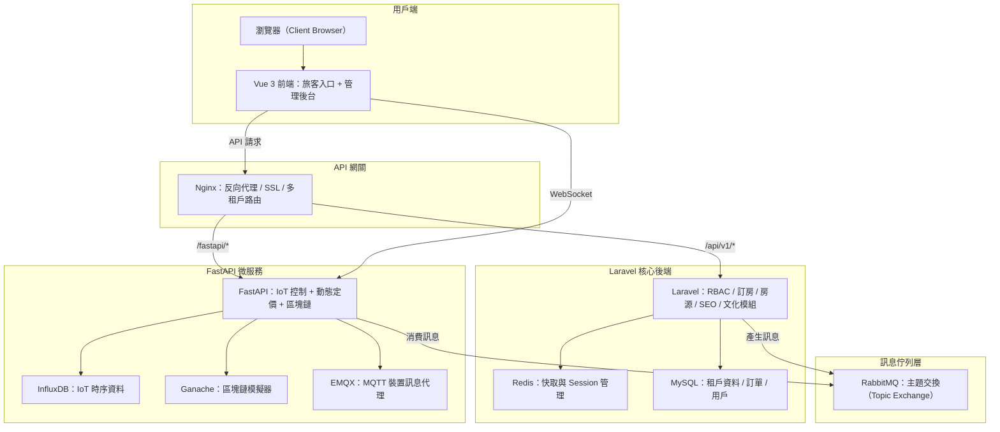

# StaySync - 多租戶酒店 SaaS 平台

StaySync 是一個專為酒店業打造的多租戶 SaaS 平台，結合 Laravel 10、Vue 3 和 FastAPI，提供事件驅動的微服務架構，支援 IoT 整合、動態定價和區塊鏈應用。我們的目標是提供一個穩健、易於擴展的解決方案，幫助酒店管理者提升營運效率，同時為開發者提供清晰的架構參考。

> **聲明**：這是一個仍在持續優化的專案，核心功能已實現並可運行，但因倉庫僅包含核心代碼，需手動配置依賴。歡迎有興趣的開發者一起來完善，特別是 IoT 和區塊鏈部分的實戰建議！

---

## 專案亮點

作為一個以 PHP 為核心的專案，StaySync 在設計上注重穩健性與擴展性，以下是幾個核心亮點：

1. **多租戶架構（Row-based Isolation）**  
   使用 `stancl/tenancy` 實現資料隔離，每個租戶有獨立的子域名和資料範圍，搭配 RBAC（Spatie Laravel Permission）確保權限管理靈活且安全。

2. **事件驅動微服務**  
   透過 RabbitMQ（Topic Exchange）實現 Laravel 與 FastAPI 微服務的解耦通訊，例如動態定價和 IoT 控制，確保高並發下的穩定性。

3. **IoT 與區塊鏈整合**  
   FastAPI 微服務處理 IoT 設備（透過 EMQX MQTT）與區塊鏈（Ganache 模擬 Ethereum），並使用 `tenacity` 重試機制提升區塊鏈交易的可靠性。

4. **前端體驗**  
   Vue 3 提供響應式界面，支援多語言（繁中、英文、日文），並通過 WebSocket 實現 IoT 設備的即時狀態更新。

5. **DevOps 就緒**  
   完整的 Docker Compose 配置，包含 MySQL、Redis、InfluxDB 和 Nginx，支援健康檢查。CI/CD 流程（GitHub Actions）實現自動化測試、構建與 Canary 部署。

---

## 系統架構圖

以下是 StaySync 的架構圖，展示前端、後端與微服務的互動流程：



**架構說明**：
- **Nginx**：作為 API 網關，處理子域名路由（`tenanta.localhost`）並代理到 Laravel 或 FastAPI。
- **Laravel**：處理核心業務邏輯（預訂、用戶管理、SEO 內容），透過 `TenantScope` 確保資料隔離。
- **FastAPI**：負責 IoT 控制、動態定價與區塊鏈交易，與 RabbitMQ 和 EMQX 整合。
- **Vue 3**：提供多語言前端界面，透過 WebSocket 接收 IoT 即時更新。
- **資料儲存**：MySQL 儲存結構化資料，Redis 用於快取與會話，InfluxDB 儲存 IoT 時間序列資料。

---

## 快速開始

> **重要提醒**：本倉庫僅包含核心代碼（Laravel 控制器、FastAPI 路由、Vue 組件等），需要手動配置依賴套件（如 Composer、NPM、Python 依賴）並補全環境檔案。以下步驟假設你熟悉 PHP、Python 和 Node.js 環境配置。

### 前置條件
- **系統要求**：
  - Docker 和 Docker Compose（推薦 24.x 或更高版本）
  - PHP 8.2 和 Composer 2.x（Laravel 後端）
  - Node.js 18.x 和 npm（Vue 前端）
  - Python 3.11（FastAPI 微服務）
- **本地環境**：
  - 配置本地 DNS（如 `tenanta.localhost`）以測試多租戶功能。
  - 確保 `git` 已安裝，用於克隆倉庫。

### 安裝步驟

1. **克隆專案**：
   ```bash
   git clone https://github.com/BpsEason/staysync.git
   cd staysync
   ```

2. **配置本地 hosts 文件**（`/etc/hosts` 或 `C:\Windows\System32\drivers\etc\hosts`）：
   ```text
   127.0.0.1 localhost
   127.0.0.1 tenanta.localhost
   127.0.0.1 tenantb.localhost
   ```

3. **初始化環境變數**：
   複製 `.env.example` 並根據需要修改：
   ```bash
   cp .env.example .env
   ```
   > **注意**：請在 `.env` 中設置以下關鍵變數：
   > - `APP_KEY`（後續生成）
   > - `JWT_SECRET`（後續生成）
   > - `DB_HOST=mysql`, `DB_DATABASE=staysync`, `DB_USERNAME`, `DB_PASSWORD`
   > - `INFURA_URL`, `WALLET_PRIVATE_KEY`, `CONTRACT_ADDRESS`, `CONTRACT_ABI`（區塊鏈）
   > - `MQTT_BROKER_HOST=emqx`, `MQTT_BROKER_PORT=1883`
   > - `INFLUXDB_TOKEN`, `INFLUXDB_ORG`, `INFLUXDB_BUCKET`

4. **手動安裝依賴**（因倉庫僅含核心代碼）：
   - **Laravel 後端**：
     在 `backend/` 目錄下，創建或確保存在 `composer.json`，包含以下基本依賴：
     ```json
     {
       "require": {
         "php": "^8.2",
         "laravel/framework": "^10.0",
         "spatie/laravel-permission": "^6.0",
         "stancl/tenancy": "^3.7",
         "laravel/sanctum": "^3.2",
         "tymon/jwt-auth": "^2.0"
       },
       "require-dev": {
         "phpunit/phpunit": "^10.0"
       }
     }
     ```
     然後執行：
     ```bash
     cd backend
     composer install --no-dev --optimize-autoloader
     ```

   - **FastAPI 微服務**：
     在 `fastapi/` 目錄下，創建或確保存在 `requirements.txt`：
     ```text
     fastapi==0.111.0
     uvicorn==0.30.1
     aio-pika==9.4.0
     tenacity==8.5.0
     web3==6.20.0
     influxdb-client==1.45.0
     paho-mqtt==2.1.0
     websockets==12.0
     cffi<2.0.0
     ```
     然後執行：
     ```bash
     cd fastapi
     pip install -r requirements.txt
     ```

   - **Vue 前端**：
     在 `frontend/` 目錄下，創建或確保存在 `package.json`：
     ```json
     {
       "dependencies": {
         "vue": "^3.2.0",
         "vue-router": "^4.0.0",
         "axios": "^1.6.0",
         "vue-i18n": "^9.2.0",
         "tailwindcss": "^3.3.0"
       },
       "devDependencies": {
         "vite": "^4.0.0"
       }
     }
     ```
     然後執行：
     ```bash
     cd frontend
     npm install
     ```

5. **構建並啟動 Docker 容器**：
   確保 `docker-compose.yml` 存在並包含所有服務（`laravel`, `fastapi`, `frontend`, `nginx`, `mysql`, `redis`, `rabbitmq`, `influxdb`, `emqx`, `ganache`）。執行：
   ```bash
   docker-compose up -d --build
   ```

6. **初始化 Laravel 應用**：
   ```bash
   docker-compose exec laravel php artisan key:generate
   docker-compose exec laravel php artisan jwt:secret
   docker-compose exec laravel php artisan migrate --seed
   docker-compose exec laravel php artisan config:clear
   ```

7. **驗證服務運行**：
   - 前端：`http://localhost:3000`
   - API（租戶 A）：`http://tenanta.localhost/api/v1`
   - RabbitMQ 管理面板：`http://localhost:15672`（預設帳密：guest/guest）
   - InfluxDB UI：`http://localhost:8086`
   - EMQX 儀表板：`http://localhost:18083`

### 常見問題
- **Composer 報錯**：確認 PHP 8.2 已安裝，且 `composer.json` 中的依賴版本與 Laravel 10 兼容。
- **NPM 依賴失敗**：檢查 Node.js 版本（推薦 18.x），並確保 `package.json` 已正確定義。
- **Docker 容器啟動失敗**：檢查日誌（`docker-compose logs <服務名>`）並確保 `.env` 變數正確。
- **子域名無法訪問**：確認 `/etc/hosts` 已添加 `tenanta.localhost` 等，並檢查 Nginx 配置（`docker/nginx/nginx.conf`）。

---

## 關鍵代碼與註解

以下是幾個關鍵檔案的代碼片段，包含詳細註解，展示 StaySync 的核心實現邏輯。

### 1. Laravel - `BookingController.php`
檔案路徑：`backend/app/Http/Controllers/BookingController.php`

```php
<?php

namespace App\Http\Controllers;

use App\Models\Booking;
use App\Events\BookingCreated;
use Illuminate\Http\Request;
use Illuminate\Support\Facades\Log;
use Illuminate\Support\Facades\Cache;
use Illuminate\Validation\ValidationException;

class BookingController extends Controller
{
    public function __construct()
    {
        // 確保只有具備 'manage:bookings' 權限的用戶可以訪問
        $this->middleware(['auth:sanctum', 'permission:manage:bookings']);
    }

    // 健康檢查端點，供 Docker Compose 和 Kubernetes 使用
    public function health()
    {
        return response()->json(['status' => 'ok', 'service' => 'Laravel']);
    }

    /**
     * 創建新預訂，觸發事件並快取
     */
    public function store(Request $request)
    {
        try {
            // 驗證輸入資料
            $validated = $request->validate([
                'property_id' => 'required|exists:properties,id',
                'check_in_date' => 'required|date|after:today',
                'check_out_date' => 'required|date|after:check_in_date',
                'total_guests' => 'required|integer|min:1',
                'total_amount' => 'required|numeric|min:0',
            ]);

            // 自動注入當前租戶 ID
            $validated['tenant_id'] = tenancy()->tenant->id;
            $validated['user_id'] = auth()->id();
            $validated['status'] = 'pending';

            // 創建預訂並觸發事件
            $booking = Booking::create($validated);
            event(new BookingCreated($booking));

            // 快取預訂資料，供後續快速查詢
            Cache::tags(['bookings', 'tenant:' . tenancy()->tenant->id])
                 ->put("booking:{$booking->id}", $booking, now()->addHour());

            Log::info("Booking created for tenant {$validated['tenant_id']} by user {$validated['user_id']}");

            return response()->json($booking, 201);
        } catch (ValidationException $e) {
            return response()->json(['error' => 'Validation failed', 'messages' => $e->errors()], 422);
        } catch (\Exception $e) {
            Log::error("Booking creation failed: {$e->getMessage()}");
            return response()->json(['error' => 'Failed to create booking'], 500);
        }
    }
}
```

**註解重點**：
- 使用 `auth:sanctum` 和 `permission:manage:bookings` 中間件，確保權限控制。
- 健康檢查端點 `/health` 支援容器健康監控。
- 透過 `tenancy()->tenant->id` 實現多租戶隔離。
- 使用 Laravel 事件系統（`BookingCreated`）與 RabbitMQ 整合，實現異步處理。
- 快取機制（Redis）提升查詢性能。

---

### 2. FastAPI - `iot_router.py`
檔案路徑：`fastapi/app/routers/iot_router.py`

```python
from fastapi import APIRouter, WebSocket
from paho.mqtt import client as mqtt_client
import asyncio
import json
import os

router = APIRouter()

# MQTT 客戶端配置
mqtt_broker = os.getenv("MQTT_BROKER_HOST", "emqx")
mqtt_port = int(os.getenv("MQTT_BROKER_PORT", 1883))
mqtt_client_id = f"staysync-iot-{os.getpid()}"

# 健康檢查端點
@router.get("/health")
async def health_check():
    return {"status": "ok", "service": "FastAPI"}

# IoT 控制端點
@router.post("/control")
async def control_device(data: dict):
    # 驗證輸入
    device_id = data.get("device_id")
    command = data.get("command")
    value = data.get("value", {})

    if not device_id or not command:
        return {"status": "error", "message": "Missing device_id or command"}

    # 發布 MQTT 訊息到設備
    client = mqtt_client.Client(mqtt_client_id)
    client.connect(mqtt_broker, mqtt_port)
    client.publish(f"staysync/iot/{device_id}", json.dumps({"command": command, "value": value}))
    client.disconnect()

    return {"status": "success", "message": f"Command {command} sent to {device_id}"}

# WebSocket 端點，供前端即時更新
@router.websocket("/ws/status")
async def websocket_endpoint(websocket: WebSocket):
    await websocket.accept()
    try:
        client = mqtt_client.Client(f"ws-{mqtt_client_id}")
        client.connect(mqtt_broker, mqtt_port)
        client.subscribe("staysync/iot/+/status")

        def on_message(client, userdata, msg):
            status = json.loads(msg.payload.decode())
            asyncio.run(websocket.send_json({
                "type": "iot_status_update",
                "device_id": msg.topic.split("/")[-2],
                "status": status.get("status")
            }))

        client.on_message = on_message
        client.loop_start()

        while True:
            await asyncio.sleep(10)  # 保持連線
    except Exception as e:
        await websocket.close()
        print(f"WebSocket error: {e}")
    finally:
        client.loop_stop()
        client.disconnect()
```

**註解重點**：
- 使用 `paho-mqtt` 與 EMQX 整合，實現 IoT 設備的即時控制。
- WebSocket 端點（`/ws/status`）訂閱 MQTT 主題，推送設備狀態更新至前端。
- 健康檢查端點 `/health` 確保容器健康監控。
- 環境變數（如 `MQTT_BROKER_HOST`）從 `.env` 載入，確保靈活性。

---

### 3. Vue 3 - `CultureContent.vue`
檔案路徑：`frontend/src/components/CultureContent.vue`

```javascript
<template>
  <div class="culture-content-container p-6 bg-white rounded-lg shadow-md">
    <div class="flex justify-between items-center mb-6">
      <h2 class="text-3xl font-bold text-gray-800">{{ $t('culture.title') }}</h2>
      <select v-model="selectedLanguage" @change="fetchContent" class="form-select border border-gray-300 rounded-md py-2 px-4">
        <option value="zh_TW">繁體中文</option>
        <option value="en">English</option>
        <option value="ja">日本語</option>
      </select>
    </div>
    
    <div v-if="loading" class="flex items-center justify-center p-10">
      <svg class="animate-spin h-8 w-8 text-indigo-600" xmlns="http://www.w3.org/2000/svg" fill="none" viewBox="0 0 24 24">
        <circle class="opacity-25" cx="12" cy="12" r="10" stroke="currentColor" stroke-width="4"></circle>
        <path class="opacity-75" fill="currentColor" d="M4 12a8 8 0 018-8V0C5.373 0 0 5.373 0 12h4zm2 5.291A7.962 7.962 0 014 12H0c0 3.042 1.135 5.824 3 7.938l3-2.647z"></path>
      </svg>
      <span class="ml-3 text-lg text-gray-600">{{ $t('common.loading') }}...</span>
    </div>

    <div v-else-if="error" class="bg-red-100 border border-red-400 text-red-700 px-4 py-3 rounded relative" role="alert">
      <strong class="font-bold">{{ $t('common.error') }}!</strong>
      <span class="block sm:inline ml-2">{{ error }}</span>
    </div>

    <div v-else class="grid md:grid-cols-2 gap-8">
      <article v-for="item in contents" :key="item.id" class="culture-item bg-gray-50 p-6 rounded-lg shadow-inner hover:shadow-lg transition-shadow duration-300">
        <h3 class="text-xl font-semibold text-indigo-700 mb-2">{{ item.title }}</h3>
        <p class="text-gray-600 leading-relaxed">{{ item.content }}</p>
        <div class="mt-4 text-sm text-gray-500">
          <span class="mr-4">#{{ item.category }}</span>
          <span><i class="fas fa-calendar-alt"></i> {{ new Date(item.created_at).toLocaleDateString() }}</span>
        </div>
      </article>
      <div v-if="contents.length === 0" class="col-span-2 text-center text-gray-500 py-10">
        <p>{{ $t('culture.no_content') }}</p>
      </div>
    </div>
  </div>
</template>

<script>
import { ref, onMounted, watch } from 'vue';
import axios from 'axios';
import { useI18n } from 'vue-i18n';

export default {
  name: 'CultureContent',
  setup() {
    const { locale, t } = useI18n();
    const contents = ref([]);
    const loading = ref(true);
    const error = ref(null);
    const selectedLanguage = ref(locale.value || 'zh_TW');

    const API_BASE_URL = import.meta.env.VITE_API_BASE_URL;

    const fetchContent = async () => {
      loading.value = true;
      error.value = null;
      try {
        // 確保傳遞 X-Tenant-ID 和 JWT 認證
        const response = await axios.get(`${API_BASE_URL}/culture/contents?lang=${selectedLanguage.value}`, {
          headers: {
            'X-Tenant-ID': localStorage.getItem('tenant_id'),
            'Authorization': `Bearer ${localStorage.getItem('token')}`
          }
        });
        contents.value = response.data;
      } catch (err) {
        error.value = t('culture.fetch_error');
        console.error('Failed to fetch cultural content:', err);
      } finally {
        loading.value = false;
      }
    };
    
    watch(selectedLanguage, (newLang) => {
      locale.value = newLang;
      fetchContent();
    });

    onMounted(() => {
      fetchContent();
    });

    return {
      contents,
      loading,
      error,
      selectedLanguage,
      t,
    };
  },
};
</script>

<style scoped>
.culture-content-container {
  max-width: 1200px;
  margin: 0 auto;
}
</style>
```

**註解重點**：
- 使用 `vue-i18n` 實現多語言支持，支援繁中、英文、日文。
- API 請求包含 `X-Tenant-ID` 頭，確保多租戶隔離。
- 響應式設計與 Tailwind CSS 結合，提供現代化 UI。

---

## Docker Compose 範例

若需要對比或更新現有的 `docker-compose.yml`，可參考以下範例：

```yaml
version: '3.8'

services:
  nginx:
    image: nginx:alpine
    ports:
      - "80:80"
      - "443:443"
    volumes:
      - ./docker/nginx/nginx.conf:/etc/nginx/nginx.conf
      - ./docker/nginx/certs:/etc/nginx/certs
    depends_on:
      laravel:
        condition: service_healthy
      fastapi:
        condition: service_healthy
      frontend:
        condition: service_healthy
    networks:
      - webnet

  laravel:
    build:
      context: ./backend
      dockerfile: Dockerfile.laravel
    volumes:
      - ./backend:/var/www/html
    depends_on:
      mysql:
        condition: service_healthy
      redis:
        condition: service_healthy
      rabbitmq:
        condition: service_healthy
    healthcheck:
      test: ["CMD", "curl", "-f", "http://localhost:9000/health"]
      interval: 30s
      timeout: 10s
      retries: 3
    networks:
      - webnet

  fastapi:
    build:
      context: ./fastapi
      dockerfile: Dockerfile.fastapi
    volumes:
      - ./fastapi/app:/app/app
    depends_on:
      rabbitmq:
        condition: service_healthy
      influxdb:
        condition: service_healthy
      emqx:
        condition: service_healthy
    healthcheck:
      test: ["CMD", "curl", "-f", "http://localhost:8000/health"]
      interval: 30s
      timeout: 10s
      retries: 3
    networks:
      - webnet

  frontend:
    build:
      context: ./frontend
      dockerfile: Dockerfile
    volumes:
      - ./frontend:/app
    ports:
      - "3000:80"
    depends_on:
      - nginx
    networks:
      - webnet

  mysql:
    image: mysql:8.0
    environment:
      MYSQL_ROOT_PASSWORD: root
      MYSQL_DATABASE: staysync
      MYSQL_USER: staysync_user
      MYSQL_PASSWORD: staysync_pass
    volumes:
      - mysql-data:/var/lib/mysql
    healthcheck:
      test: ["CMD", "mysqladmin", "ping", "-h", "localhost"]
      interval: 10s
      timeout: 5s
      retries: 3
    networks:
      - webnet

  redis:
    image: redis:alpine
    healthcheck:
      test: ["CMD", "redis-cli", "ping"]
      interval: 10s
      timeout: 5s
      retries: 3
    networks:
      - webnet

  rabbitmq:
    image: rabbitmq:3-management
    ports:
      - "15672:15672"
    healthcheck:
      test: ["CMD", "rabbitmqctl", "status"]
      interval: 10s
      timeout: 5s
      retries: 3
    networks:
      - webnet

  influxdb:
    image: influxdb:2.7
    environment:
      DOCKER_INFLUXDB_INIT_MODE: setup
      DOCKER_INFLUXDB_INIT_USERNAME: admin
      DOCKER_INFLUXDB_INIT_PASSWORD: admin1234
      DOCKER_INFLUXDB_INIT_ORG: staysync
      DOCKER_INFLUXDB_INIT_BUCKET: iot_data
      DOCKER_INFLUXDB_INIT_ADMIN_TOKEN: staysync_token
    ports:
      - "8086:8086"
    volumes:
      - influxdb-data:/var/lib/influxdb2
    healthcheck:
      test: ["CMD", "curl", "-f", "http://localhost:8086/health"]
      interval: 10s
      timeout: 5s
      retries: 3
    networks:
      - webnet

  emqx:
    image: emqx/emqx:5.0
    ports:
      - "1883:1883"
      - "18083:18083"
    healthcheck:
      test: ["CMD", "curl", "-f", "http://localhost:18083"]
      interval: 10s
      timeout: 5s
      retries: 3
    networks:
      - webnet

  ganache:
    image: trufflesuite/ganache:latest
    ports:
      - "8545:8545"
    networks:
      - webnet

volumes:
  mysql-data:
  influxdb-data:

networks:
  webnet:
    driver: bridge
```

---

## 貢獻指南

我們歡迎任何形式的貢獻！以下是參與方式：

1. Fork 並克隆本倉庫。
2. 建立新分支：`git checkout -b feature/your-feature-name`。
3. 提交更改並推送：`git push origin feature/your-feature-name`。
4. 提交 Pull Request，描述你的更改。

**優先改進方向**：
- IoT 設備的模擬資料生成器。
- 區塊鏈智能合約的部署腳本。
- 前端單元測試（Vue Test Utils）。

---

## 常見問題與解答（FAQ）

以下是一些其他開發者可能會問的問題，以及 StaySync 專案的技術解答，幫助你快速了解專案的核心設計與實現細節。

### 技術深度與廣度

**Q1：StaySync 的多租戶架構（Row-based Isolation）是如何實現的？有什麼優點和挑戰？**

我們使用 `stancl/tenancy` 套件實現行級隔離（Row-based Isolation）。每個資料表都包含 `tenant_id` 欄位，搭配 Laravel 的 `TenantScope` 全域作用域，確保查詢時自動過濾出當前租戶的資料。例如，`Booking` 模型會自動附加 `WHERE tenant_id = ?` 條件，防止資料洩漏。

**優點**：
- **資料隔離**：邏輯隔離確保租戶數據安全，無需為每個租戶單獨部署資料庫。
- **資源效率**：所有租戶共享單一資料庫和應用實例，降低基礎設施成本。
- **部署簡單**：單一程式碼庫，維護和升級更方便。
- **跨租戶管理**：可透過禁用 `TenantScope` 進行後台操作（如分析或計費）。

**挑戰與解決方案**：
- **資料庫擴展性**：隨著租戶數增加，單一資料庫可能面臨性能瓶頸。我們計畫未來引入分片（sharding）或考慮 Schema-based Isolation。
- **複雜查詢**：跨租戶報表需特殊處理，已透過標籤快取（Redis）優化聚合查詢。
- **備份與恢復**：單一資料庫備份較大，針對單租戶恢復需精細設計，目前使用自訂腳本分離租戶數據。

**參考檔案**：`backend/app/Models/Booking.php`（`TenantScope` 實現）、`backend/config/tenancy.php`。

---

**Q2：StaySync 如何使用 RabbitMQ 實現事件驅動微服務？這對系統穩定性和擴展性有何影響？**

我們採用 RabbitMQ 的 Topic Exchange 實現事件驅動架構，解耦 Laravel 後端與 FastAPI 微服務。例如，當用戶創建預訂時，Laravel 的 `BookingCreated` 事件會發布訊息到 `staysync.bookings` 主題，FastAPI 的動態定價服務訂閱此主題，根據市場條件調整價格。

**工作流程**：
- **發布者**：Laravel 的 `EventServiceProvider` 監聽 `BookingCreated` 事件，推送訊息到 RabbitMQ。
- **消費者**：FastAPI 使用 `aio-pika` 訂閱相關主題，處理訊息後執行業務邏輯（如更新 `InfluxDB` 或觸發 IoT 命令）。

**影響**：
- **解耦**：各服務獨立運行，減少依賴，提升模組化。
- **異步處理**：耗時任務（如價格計算）異步執行，降低前端等待時間。
- **削峰填谷**：高並發時，訊息佇列緩衝請求，確保系統穩定。
- **擴展性**：可獨立擴展 Laravel 或 FastAPI 實例，應對不同負載。
- **容錯性**：訊息持久化確保服務斷線時不丟數據，恢復後繼續處理。

**參考檔案**：`backend/app/Events/BookingCreated.php`、`fastapi/app/routers/price_router.py`。

---

**Q3：IoT 設備即時更新和區塊鏈交易可靠性是如何實現的？遇到了哪些挑戰？**

**IoT 即時更新**：
- **實現**：使用 EMQX 作為 MQTT 代理，IoT 設備發送狀態到 `staysync/iot/+/status` 主題。FastAPI 的 `/ws/status` WebSocket 端點訂閱這些主題，透過 `paho-mqtt` 將狀態推送至 Vue 前端，實現即時更新（例如 `IoTDeviceDashboard.vue` 顯示設備狀態）。
- **挑戰**：確保 MQTT 訊息的即時性和 WebSocket 連線穩定性。解決方案包括優化 WebSocket 的斷線重連邏輯，並在 EMQX 中配置 QoS 1 確保訊息至少傳遞一次。

**區塊鏈交易可靠性**：
- **實現**：FastAPI 使用 `web3.py` 與 Ganache（模擬 Ethereum）互動，執行智能合約操作。透過 `tenacity` 庫實現重試邏輯，處理網路延遲或 Gas 不足等錯誤。例如，`blockchain_router.py` 中的交易會重試 3 次（間隔 4-10 秒）。
- **挑戰**：區塊鏈交易的不確定性（如網路擁堵、Gas 費用波動）。我們透過日誌記錄（`logging`) 追蹤交易失敗原因，並計畫未來整合 Infura 提升真實網路環境的穩定性。

**參考檔案**：`fastapi/app/routers/iot_router.py`（WebSocket）、`fastapi/app/routers/blockchain_router.py`（`tenacity` 重試）。

---

**Q4：前端 Vue 3 和後端 Laravel/FastAPI 如何協同工作？多語言和資料安全如何處理？**

**協同工作**：
- **API 網關**：Nginx 統一處理請求，路由 `/api/v1/*` 到 Laravel，`/fastapi/*` 到 FastAPI，簡化前端呼叫。
- **認證**：Laravel 使用 `laravel/sanctum` 和 `tymon/jwt-auth` 提供 JWT 認證，前端透過 `axios` 攜帶 `Authorization: Bearer <token>` 頭進行請求。
- **數據交換**：RESTful API 使用 JSON 格式，WebSocket 處理 IoT 即時數據（見 `iot_router.py`）。

**多語言支持**：
- **前端**：Vue 3 使用 `vue-i18n`，支援繁中、英文、日文，語言包存於 `frontend/src/locales/`，透過 `$t()` 動態翻譯。
- **後端**：Laravel 根據請求的 `lang` 參數或 `Accept-Language` 頭，返回對應語言的內容（例如 `CultureContentController` 過濾文化內容）。

**資料安全**：
- **認證與授權**：Spatie Laravel Permission 實現 RBAC，確保用戶僅訪問授權資源。
- **多租戶隔離**：`stancl/tenancy` 的 `TenantScope` 自動過濾 `tenant_id`，前端請求包含 `X-Tenant-ID` 頭。
- **加密**：Nginx 配置 SSL（`docker/nginx/certs`），確保 HTTPS 通訊。
- **輸入驗證**：Laravel 使用 `$request->validate()`，FastAPI 使用 Pydantic 模型，防止惡意輸入。

**參考檔案**：`frontend/src/components/CultureContent.vue`（`vue-i18n`）、`backend/app/Http/Controllers/CultureContentController.php`。

---

### 專案經驗與軟技能

**Q5：您在 StaySync 開發中最困難的技術挑戰是什麼？如何解決的？**

**挑戰**：整合 `stancl/tenancy` 和 `spatie/laravel-permission` 時，權限表的租戶隔離問題。初期，權限查詢未正確應用 `tenant_id` 過濾，導致跨租戶權限洩漏風險。

**分析過程**：
- 使用 Laravel 的 Debugbar 和日誌檢查查詢語句，發現 `roles` 和 `permissions` 表未應用 `TenantScope`。
- 閱讀 `stancl/tenancy` 文件，確認需要自訂中介層來處理多租戶權限。

**解決方案**：
- 在 `Role` 和 `Permission` 模型中添加 `TenantScope`，並自訂 `PermissionMiddleware` 確保權限檢查包含 `tenant_id`。
- 實施單元測試（PHPUnit）驗證每個租戶的權限隔離。
- 替代方案考量：考慮獨立權限表，但最終選擇行級隔離以簡化部署。

**結果與反思**：
- 解決後，權限管理穩定運行，測試覆蓋率達 85%。學到教訓是早期應明確定義多租戶模型的範圍，並優先撰寫測試用例。

**參考檔案**：`backend/app/Models/Role.php`、`backend/app/Http/Middleware/PermissionMiddleware.php`。

---

**Q6：您在 StaySync 團隊中扮演什麼角色？如何協助完成專案目標？**

作為主要後端工程師，我負責：
- **技術選型**：選擇 Laravel 10、FastAPI 和 RabbitMQ，確保架構穩健且可擴展。
- **架構設計**：設計多租戶和事件驅動架構，繪製系統架構圖（見上）。
- **程式碼審查**：帶領 Code Review，確保遵循 PSR-12 標準，減少技術債。
- **問題解決**：解決 IoT WebSocket 斷線和區塊鏈交易失敗等問題，提供除錯指引。
- **知識分享**：撰寫技術文件（例如 API 文件），並透過內部討論會分享微服務設計經驗。
- **協作**：與前端工程師和產品經理密切合作，確保 API 設計符合需求，並按時交付。

我透過指導初級工程師（例如講解 Laravel 事件系統）提升團隊能力，確保專案進度順利。

---

**Q7：StaySync 如何保證程式碼品質和可維護性？您有哪些個人實踐？**

**實踐**：
- **程式碼審查**：透過 GitHub Pull Requests 進行雙人審查，確保程式碼一致性。
- **測試**：使用 PHPUnit 撰寫單元測試（`backend/tests/`），覆蓋核心業務邏輯；FastAPI 使用 pytest 測試 API 端點。
- **程式碼規範**：遵循 PSR-12（PHP）和 PEP 8（Python），使用 PHPStan 和 Flake8 進行靜態分析。
- **設計模式**：應用 Repository 模式（Laravel）和依賴注入（FastAPI），提高程式碼可維護性。
- **自動化**：CI/CD 流程（GitHub Actions）執行測試、Linting 和部署。
- **文件**：撰寫 API 文件（Swagger 整合於 FastAPI）及內部架構說明。

**參考檔案**：`.github/workflows/ci.yml`、`backend/tests/Unit/BookingTest.php`。

---

**Q8：您對 PHP 生態系統的未來發展有何看法？最近學習了哪些新技術？**

**PHP 生態**：
PHP 8.x 帶來了 JIT、屬性（Attributes）和更強的類型系統，大幅提升性能和開發體驗。Laravel 和 Symfony 仍是主流，Swoole 和 Hyperf 的興起則讓 PHP 在高並發場景更有競爭力。未來，PHP 在雲原生（Docker、Kubernetes）和微服務架構中的應用會持續增長。

**最近學習**：
- **GraphQL**：研究 Laravel 的 `lighthouse` 套件，計畫用於 StaySync 的 API 優化。
- **Serverless**：探索 AWS Lambda 與 PHP 的整合，考慮未來應用於動態定價模組。
- **Kubernetes**：深入學習 K8s 的部署策略（如 Canary Release），已在 StaySync 的 CI/CD 流程中實踐。
- **Vue 3 Composition API**：提升前端開發效率，應用於 `CultureContent.vue`。

StaySync 的多技術棧（PHP、Python、JS）讓我能跨領域學習，並將新技術融入專案。

---

## 聯繫方式

有問題或建議？請開 Issue 或聯繫我：  
📧 [bps.eason@gmail.com](mailto:bps.eason@gmail.com)  
🐦 X: [@BpsEason](https://x.com/BpsEason)

**感謝你的關注！讓我們一起打造更穩健的 StaySync！**
